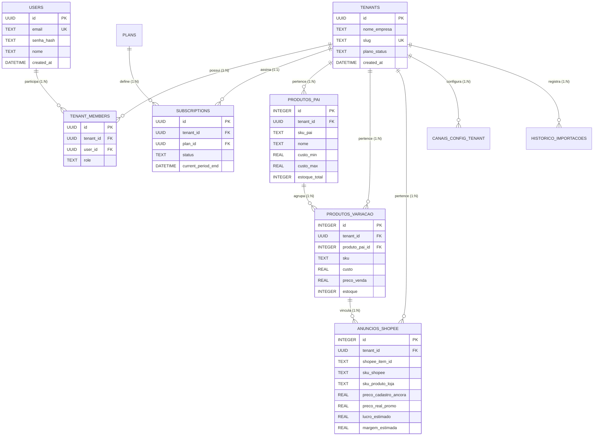

# 🚀 Plano Arquitetural: Transformação do StokPic em SaaS Multi-Tenant

## 1. Resposta Direta & Recomendação Estratégica

> [!IMPORTANT]
> **Recomendação Definitiva:** Utilize **Multi-Tenancy Compartilhado com `tenant_id` + RLS (Row-Level Security) no PostgreSQL** (ou na camada de aplicação via Middleware/ORM).
> **NUNCA** crie "uma tabela por cliente" (`produtos_cliente_1`, `produtos_cliente_2`).

### ❌ Por que "Uma Tabela por Cliente" é um Anti-Pattern Grave:
1. **Explosão do Catálogo do Banco:** Se você tiver 1.000 clientes com 6 tabelas cada, seu banco terá **6.000 tabelas**. O banco esgota memória interna, descritores de arquivos e perde a capacidade de otimizar planos de execução.
2. **Pesadelo de Migrações (DDL):** Ao adicionar uma nova coluna (ex: taxa da Shopee 2026), você precisará rodar `ALTER TABLE` 1.000 vezes, com alto risco de travar o banco ou deixar clientes desatualizados.
3. **Impossibilidade de Métricas Globais:** Fazer um dashboard administrativo (ex: "Quantos produtos cadastrados em todo o SaaS?") exigiria fazer `UNION ALL` de milhares de tabelas.
4. **Pool de Conexões e Cache Ineficientes:** O banco não consegue reaproveitar cache de schema nem índices eficientemente.

### ✅ Por que Shared Schema com `tenant_id` + RLS é o Padrão da Indústria (Shopify, Stripe, Bling, Tiny):
- **Uma única estrutura de tabelas** para todos os clientes, diferenciada pela coluna `tenant_id` (ou `account_id`).
- **Segurança Garantida por RLS:** O próprio motor do PostgreSQL garante que o Usuário A **nunca** veja dados do Usuário B, mesmo que o desenvolvedor esqueça o `WHERE tenant_id = ...` em uma query.
- **Escalabilidade e Custo:** Milhares de clientes podem rodar na mesma instância de banco de dados com custo operacional mínimo.
- **Migrações em 1 Segundo:** Um `ALTER TABLE` atualiza a funcionalidade para todos os usuários simultaneamente.

---

## 2. Matriz Comparativa de Modelos de Multi-Tenancy

| Critério | Tabela por Cliente ❌ | Banco por Cliente ⚠️ | Shared Schema com RLS / tenant_id ✅ (Recomendado) |
| :--- | :---: | :---: | :---: |
| **Custo de Infraestrutura** | Muito Alto | Muito Alto | **Mínimo e Otimizado** |
| **Complexidade de Migrações** | Caótica | Muito Alta | **Simples e Centralizada** |
| **Escala (100 a 10.000 clientes)** | Inviável | Difícil de gerenciar | **Excelente (milhares de tenants)** |
| **Isolamento de Segurança** | Médio | Máximo | **Máximo (garantido por RLS)** |
| **Backup e Restore Individual** | Complexo | Fácil | **Fácil (via filtro por tenant_id)** |
| **Padrão de Mercado SaaS** | Obsoleto / Anti-pattern | Casos raros (Bancos/Saúde) | **Padrão em 99% dos SaaS modernos** |

---

## 3. Modelo Entidade-Relacionamento do SaaS (Mermaid ER)



---

## 4. Como Funciona o RLS (Row-Level Security) na Prática

No PostgreSQL (ou Supabase/Neon), o isolamento de dados é aplicado diretamente a nível de banco:

```sql
-- 1. Habilitar RLS na tabela
ALTER TABLE produtos_variacao ENABLE ROW LEVEL SECURITY;

-- 2. Criar a política de isolamento por Tenant
CREATE POLICY tenant_isolation_policy ON produtos_variacao
    FOR ALL
    USING (tenant_id = current_setting('app.current_tenant_id', true)::uuid)
    WITH CHECK (tenant_id = current_setting('app.current_tenant_id', true)::uuid);

-- 3. No Backend (FastAPI / Node), ao receber uma requisição autenticada do usuário:
-- SET LOCAL app.current_tenant_id = 'e2b3c4d5-6789-...';
-- Todas as queries a seguir automaticamente só retornarão e alterarão os dados daquele tenant!
```

---

## 5. Arquitetura da Aplicação SaaS (Do Local para a Nuvem)

```
                       ┌─────────────────────────────────────┐
                       │     Cliente Web / SPA / Mobile      │
                       │   (React / Next.js / Vue / HTML)    │
                       └──────────────────┬──────────────────┘
                                          │
                                          │ HTTPS + JWT Bearer Token (Tenant ID no payload)
                                          ▼
                       ┌─────────────────────────────────────┐
                       │           API Gateway / BFF         │
                       │        (Python FastAPI / Node)      │
                       │  - Autenticação & Validação JWT     │
                       │  - Tenant Middleware Context        │
                       │  - Rate Limiting por Plano          │
                       └──────────────────┬──────────────────┘
                                          │
                        ┌─────────────────┴─────────────────┐
                        ▼                                   ▼
          ┌───────────────────────────┐       ┌───────────────────────────┐
          │    PostgreSQL com RLS     │       │     Armazenamento Cloud   │
          │  (Supabase / Neon / RDS)  │       │     (S3 / R2 para fotos   │
          │  - Tabelas Compartilhadas │       │        e planilhas .xlsx) │
          │  - Isolamento por Tenant  │       └───────────────────────────┘
          └───────────────────────────┘
```

---

## 6. Roadmap de Migração em 5 Fases

1. **Fase 1 (Estruturação de Dados):**
   - Adicionar a coluna `tenant_id UUID` em todas as tabelas de dados (`produtos_pai`, `produtos_variacao`, `anuncios_shopee`, `historico_importacoes`).
   - Criar chaves compostas exclusivas por cliente: `UNIQUE(tenant_id, sku)`.
2. **Fase 2 (Camada de API Backend):**
   - Criar uma API em Python (FastAPI) para centralizar autenticação, upload de planilhas por usuário e consultas.
   - Implementar middleware que extrai o `tenant_id` do token JWT em cada requisição.
3. **Fase 3 (Infraestrutura de Banco na Nuvem):**
   - Migrar do SQLite local para PostgreSQL gerenciado (ex: Supabase, Neon ou AWS RDS) ativando Row-Level Security.
4. **Fase 4 (Interface Web Multi-Usuário):**
   - Telas de Cadastro, Login, Recuperação de Senha e Troca de Empresa/Loja.
   - O usuário faz o upload da sua própria planilha do ERP e vê instantaneamente seus simuladores e auditorias isolados.
5. **Fase 5 (Monetização & Planos):**
   - Plano Grátis (até 50 produtos).
   - Plano Pro (produtos ilimitados + Shopee + TikTok Shop + Afiliados).
   - Integração com Stripe / Asaas para cobrança recorrente automática.
