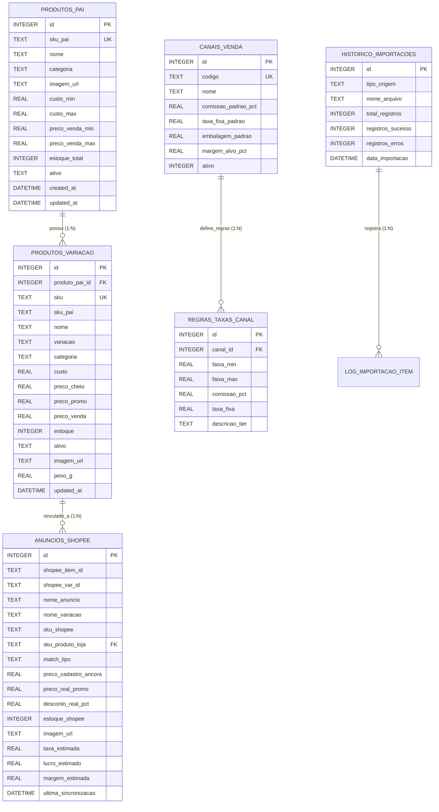

# 🗄️ Plano de Migração e Arquitetura de Banco de Dados Local (SQLite) — StokPic

## 1. Visão Geral e Motivação

Atualmente, o sistema opera com dados extraídos de planilhas Excel (`.xlsx`) convertidos diretamente em arquivos JavaScript (`dados_produtos.js` e `dados_shopee_real.js`) e arquivos JSON estáticos.

### 🎯 Objetivos da Migração para SQLite:
1. **Centralização e Consistência:** Ter uma única fonte da verdade para produtos, variações, custos, preços de tabela e anúncios da Shopee/TikTok.
2. **Integridade Referencial:** Vínculo formal entre produtos pai, variações por SKU e anúncios em múltiplos marketplaces através de chaves estrangeiras (`FOREIGN KEY`).
3. **Histórico e Auditoria:** Rastrear data de importação, histórico de alteração de preços, alterações de estoque e status de matching.
4. **Portabilidade e Zero Configuração:** O SQLite é embutido nativamente no Python (`sqlite3`), não exige instalação de servidores de banco (como MySQL ou Postgres) e armazena tudo em um único arquivo `.db`.
5. **Caminho para o Futuro:** Permite evoluir facilmente para APIs locais (FastAPI/Flask) ou bancos em nuvem (PostgreSQL/Supabase) no futuro sem retrabalho de modelagem.

---

## 2. Modelo Entidade-Relacionamento (Mermaid ER)



---

## 3. Estrutura e DDL das Tabelas (SQL Schema)

O arquivo do banco será salvo em `data/database/stokpic.db`.

```sql
-- Habilitar Foreign Keys no SQLite
PRAGMA foreign_keys = ON;

-- 1. Produtos Pai / Modelos Agrupados
CREATE TABLE IF NOT EXISTS produtos_pai (
    id INTEGER PRIMARY KEY AUTOINCREMENT,
    sku_pai TEXT UNIQUE NOT NULL,
    nome TEXT NOT NULL,
    categoria TEXT,
    imagem_url TEXT,
    custo_min REAL NOT NULL DEFAULT 0.0,
    custo_max REAL NOT NULL DEFAULT 0.0,
    preco_venda_min REAL NOT NULL DEFAULT 0.0,
    preco_venda_max REAL NOT NULL DEFAULT 0.0,
    estoque_total INTEGER NOT NULL DEFAULT 0,
    ativo TEXT NOT NULL DEFAULT 'S',
    created_at DATETIME DEFAULT CURRENT_TIMESTAMP,
    updated_at DATETIME DEFAULT CURRENT_TIMESTAMP
);

-- 2. Variações / SKUs Individuais do Catálogo
CREATE TABLE IF NOT EXISTS produtos_variacao (
    id INTEGER PRIMARY KEY AUTOINCREMENT,
    produto_pai_id INTEGER REFERENCES produtos_pai(id) ON DELETE CASCADE,
    sku TEXT UNIQUE NOT NULL,
    sku_pai TEXT,
    nome TEXT NOT NULL,
    variacao TEXT,
    categoria TEXT,
    custo REAL NOT NULL DEFAULT 0.0,
    preco_cheio REAL NOT NULL DEFAULT 0.0,
    preco_promo REAL NOT NULL DEFAULT 0.0,
    preco_venda REAL NOT NULL DEFAULT 0.0,
    estoque INTEGER NOT NULL DEFAULT 0,
    ativo TEXT NOT NULL DEFAULT 'S',
    imagem_url TEXT,
    peso_g REAL DEFAULT 0.0,
    created_at DATETIME DEFAULT CURRENT_TIMESTAMP,
    updated_at DATETIME DEFAULT CURRENT_TIMESTAMP
);

CREATE INDEX IF NOT EXISTS idx_variacao_sku ON produtos_variacao(sku);
CREATE INDEX IF NOT EXISTS idx_variacao_sku_pai ON produtos_variacao(sku_pai);

-- 3. Anúncios Shopee (com preços âncora e promoções reais)
CREATE TABLE IF NOT EXISTS anuncios_shopee (
    id INTEGER PRIMARY KEY AUTOINCREMENT,
    shopee_item_id TEXT,
    shopee_var_id TEXT,
    nome_anuncio TEXT NOT NULL,
    nome_variacao TEXT,
    sku_anuncio TEXT,
    sku_variacao TEXT,
    sku_produto_loja TEXT REFERENCES produtos_variacao(sku) ON DELETE SET NULL,
    match_tipo TEXT, -- 'SKU Direto', 'ID Variante', 'Similaridade', 'Manual'
    preco_cadastro_ancora REAL NOT NULL DEFAULT 0.0,
    preco_real_promo REAL NOT NULL DEFAULT 0.0,
    desconto_real_pct REAL NOT NULL DEFAULT 0.0,
    estoque_shopee INTEGER NOT NULL DEFAULT 0,
    imagem_url TEXT,
    taxa_estimada REAL DEFAULT 0.0,
    repasse_estimado REAL DEFAULT 0.0,
    lucro_estimado REAL DEFAULT 0.0,
    margem_estimada REAL DEFAULT 0.0,
    tier_shopee TEXT,
    ultima_sincronizacao DATETIME DEFAULT CURRENT_TIMESTAMP
);

CREATE INDEX IF NOT EXISTS idx_shopee_sku_loja ON anuncios_shopee(sku_produto_loja);
CREATE INDEX IF NOT EXISTS idx_shopee_var_id ON anuncios_shopee(shopee_var_id);

-- 4. Canais de Venda e Parâmetros
CREATE TABLE IF NOT EXISTS canais_venda (
    id INTEGER PRIMARY KEY AUTOINCREMENT,
    codigo TEXT UNIQUE NOT NULL, -- 'shopee', 'tiktok', 'loja'
    nome TEXT NOT NULL,
    comissao_padrao_pct REAL NOT NULL DEFAULT 0.0,
    taxa_fixa_padrao REAL NOT NULL DEFAULT 0.0,
    embalagem_padrao REAL NOT NULL DEFAULT 1.50,
    margem_alvo_pct REAL NOT NULL DEFAULT 20.0,
    ativo INTEGER NOT NULL DEFAULT 1
);

-- 5. Regras de Taxas Dinâmicas por Faixa de Preço (ex: Shopee 2026, TikTok Shop)
CREATE TABLE IF NOT EXISTS regras_taxas_canal (
    id INTEGER PRIMARY KEY AUTOINCREMENT,
    canal_id INTEGER REFERENCES canais_venda(id) ON DELETE CASCADE,
    faixa_min REAL NOT NULL,
    faixa_max REAL NOT NULL,
    comissao_pct REAL NOT NULL,
    taxa_fixa REAL NOT NULL,
    descricao_tier TEXT NOT NULL
);

-- 6. Histórico de Importações / Logs
CREATE TABLE IF NOT EXISTS historico_importacoes (
    id INTEGER PRIMARY KEY AUTOINCREMENT,
    tipo_origem TEXT NOT NULL, -- 'CATALOGO_LOJA', 'SHOPEE_ANUNCIOS'
    nome_arquivo TEXT NOT NULL,
    total_registros INTEGER NOT NULL DEFAULT 0,
    registros_sucesso INTEGER NOT NULL DEFAULT 0,
    registros_erros INTEGER NOT NULL DEFAULT 0,
    detalhes_json TEXT,
    data_importacao DATETIME DEFAULT CURRENT_TIMESTAMP
);
```

---

## 4. Arquitetura de Integração: Como o Banco se Conecta ao Projeto

```
                ┌──────────────────────────────────────────────┐
                │        Planilhas Excel de Entrada            │
                │  - produtos-2026-03-28.xlsx                  │
                │  - Shopee_Anuncios_Exportacao.xlsx           │
                └──────────────────────┬───────────────────────┘
                                       │
                                       ▼ (Python ETL)
                ┌──────────────────────────────────────────────┐
                │          scripts/db/database.py              │
                │  - Criação de Schemas                        │
                │  - Ingestão com Upsert (INSERT OR REPLACE)   │
                │  - Matching Inteligente de SKUs              │
                └──────────────────────┬───────────────────────┘
                                       │
                                       ▼ (Persistência)
                ┌──────────────────────────────────────────────┐
                │        💾 data/database/stokpic.db           │
                │              (Banco SQLite)                  │
                └──────────────────────┬───────────────────────┘
                                       │
                                       ▼ (Geração Automatizada)
                ┌──────────────────────────────────────────────┐
                │          scripts/db/export_web.py            │
                │  - web/data/dados_produtos.js                │
                │  - web/data/dados_shopee_real.js             │
                └──────────────────────┬───────────────────────┘
                                       │
                                       ▼ (Consumo Instantâneo)
                ┌──────────────────────────────────────────────┐
                │        🌐 Aplicação Web (index.html)         │
                │  - Carrega localmente sem precisar de server │
                │  - Performance máxima (100% offline)         │
                └──────────────────────────────────────────────┘
```

---

## 5. Módulos Python a Serem Criados

1. **`scripts/db/db_manager.py`**:
   - Inicializa a conexão SQLite com o banco `stokpic.db`.
   - Executa as migrations e cria todas as tabelas e índices se não existirem.
   - Popula as tabelas de canais e regras fiscais/tarifárias (Shopee 2026 e TikTok Shop 2026).

2. **`scripts/db/import_catalogo.py`**:
   - Lê a planilha do catálogo (`produtos-*.xlsx`).
   - Valida colunas (SKU, Custo, Preço, Estoque).
   - Realiza o *Upsert* nas tabelas `produtos_pai` e `produtos_variacao`.
   - Registra o log no `historico_importacoes`.

3. **`scripts/db/import_shopee.py`**:
   - Lê a exportação de anúncios da Shopee.
   - Cruza variações com `produtos_variacao` por SKU direto, SKU pai ou ID variante.
   - Salva os anúncios e calcula as métricas no banco SQLite.

4. **`scripts/db/export_web.py`**:
   - Faz queries analíticas consolidadas no SQLite.
   - Gera os arquivos `dados_produtos.js`, `dados_shopee_real.js` e JSONs em milissegundos para a interface web.

5. **`Atualizar_Banco_e_Dados.bat`**:
   - Script batch que executa toda a esteira de banco e exportação em um duplo-clique.

---

## 6. Plano de Execução Passo a Passo

1. **Aprovação do Schema:** Validação deste planejamento e dos modelos de tabelas.
2. **Criação do Banco SQLite:** Desenvolvimento do script `scripts/db/db_manager.py` para instanciar o banco `stokpic.db`.
3. **Carga e Ingestão de Dados:** Ingestão dos 376 itens de catálogo e 178 anúncios Shopee com relacionamentos de chaves estrangeiras.
4. **Exportador para a Web:** Implementação de `scripts/db/export_web.py` para sincronizar o banco com os arquivos de dados do frontend.
5. **Automação e Testes:** Teste de execução do fluxo completo via `.bat` e versionamento no Git.
